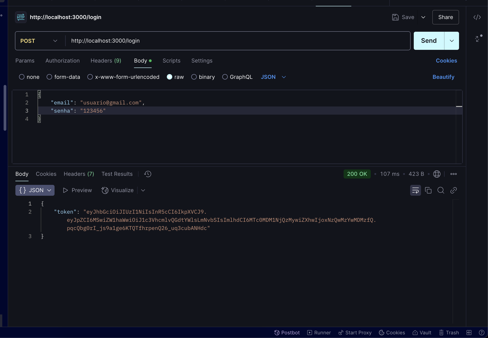
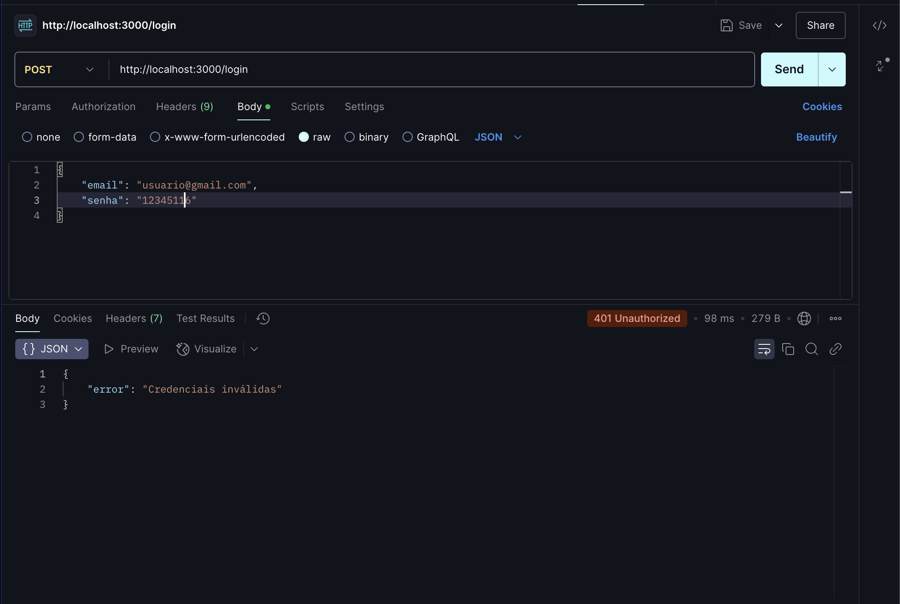

# Projeto de Autenticação com Express e JWT

Este projeto é uma atividade da disciplina de Sistemas Distribuídos, que demonstra a implementação de um simples sistema de autenticação utilizando Node.js, Express, JWT (JSON Web Tokens) e bcrypt para simulação de um banco de dados em JSON.

## Alunos
- Edwin Nichollas Rocha Medina - 2221152
- Gabriel Homsi Gonçalves de Almeida - 2210364
- João Victor Guimarães Santos - 2212057
- João Vitor Luiz Soares Silva - 2212349
- Felipe Brian Marques Gonçalves - 2210360

Docente: Alvaro Bastos


## Descrição

O projeto consiste em um servidor Express que oferece um endpoint de login. Os usuários podem autenticar-se utilizando um email e senha. As senhas são armazenadas de forma segura utilizando bcrypt, e um token JWT é gerado para sessões autenticadas.

## Tecnologias Utilizadas

- Node.js
- Express
- JSON Web Tokens (JWT)
- bcrypt.js


## Instalação

1. Clone o repositório:
   ```bash
   git clone https://github.com/joaosantosg/studious-octo-enigma.git
   ```
2. Navegue até o diretório do projeto:
   ```bash
   cd studious-octo-enigma
   ```
3. Instale as dependências:
   ```bash
   npm install
   ```

## Uso

1. Inicie o servidor:
   ```bash
   node index.js
   ```
2. O servidor estará rodando na porta especificada 3000

> **Nota:** O sistema já possui um usuário cadastrado para testes:
> - Email: usuario@gmail.com
> - Senha: 123456

## Endpoints

### POST /login

- **Descrição:** Autentica um usuário e retorna um token JWT.
- **Corpo da Requisição:**
  ```json
  {
    "email": "usuario@gmail.com",
    "senha": "123456"
  }
  ```
- **Resposta de Sucesso:**
  ```json
  {
    "token": "seu_token_jwt"
  }
  ```
- **Erros Possíveis:**
  - `400`: Email e senha são obrigatórios.
  - `401`: Credenciais inválidas.

## Exemplo de Uso

Aqui estão alguns prints do funcionamento do endpoint de autenticação:





